author: Ayca Öner
id: mendix_rest_sql_cconnector
summary: Guide on how to use the Mendix REST SQL Connector to use data from Snowflake in your Mendix application and enrich your app with the capabilities that Snowflake provides via REST calls.
categories: connectors, partner-integrations
environments: web
status: Published
tags: Getting Started, Data Science, Data Engineering, Connectors, Native Apps, External Connectivity, Mendix
# An Introduction to the Mendix REST SQL Connector
<!-- ------------------------ -->
## Overview
Duration: 5

In this quickstart, we will guide you through the process of setting up a secure connection, retrieving data stored in Snowflake and seamlessly integrating it into a Mendix application.

[Mendix](https://www.mendix.com/snowflake/) is a low code application development platform that will allow you to quickly easily develop enterprise applications. Compared to [Snowflake native apps](https://docs.snowflake.com/en/developer-guide/native-apps/native-apps-about) built with [Streamlit](https://docs.snowflake.com/en/developer-guide/streamlit/about-streamlit), Mendix allows for more custom user interfaces and multi-experiences for all forms of interaction like websites and mobile applications. Mendix applications typically support full workflows for business applications and support multiple deployment options, including public cloud, private cloud, on-premises and on-edge deployment.

Streamlit is tailored for developers and data analysts, requiring Python expertise to create dashboards. In contrast, Mendix focuses more on business applications, enabling users to build mobile-ready apps and responsive websites without any coding. Additionally, the Mendix Marketplace offers a wide range of ready-to-use frontend widgets and connectors.

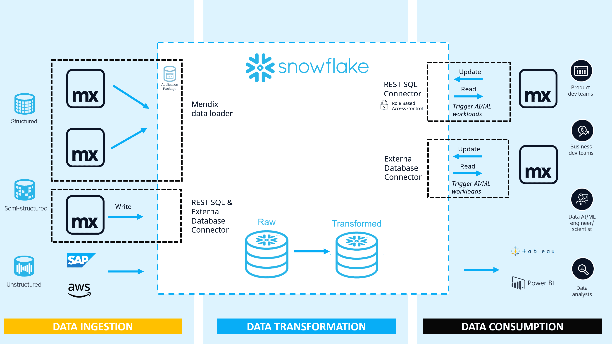

This quickstart will equip you with the knowledge and tools needed to achieve seamless data integration between Mendix and Snowflake. Within Mendix two Snowflake connectors are provided, the [External Database Connector](https://marketplace.mendix.com/link/component/219862) and the [Snowflake REST SQL Connector](https://marketplace.mendix.com/link/component/225717)connecting Mendix to Snowflake. Conversely, Mendix has developed the Mendix Data Loader, connecting a Snowflake environment to a Mendix application. To learn more about the Mendix Data Loader, see [Mendix Data Loader Quickstart](https://quickstarts.snowflake.com/guide/mendix_data_loader/index.html#0).

This quickstart will focus on the Snowflake REST SQL Connector.

The Snowflake REST SQL connector provides a way to set up key-pair authentication with an RSA key pair according to the PKCS #8 standard or with OAuth, and then execute SQL statements on Snowflake via a REST call from within your Mendix application. These statements allow you to perform the following tasks:

  - Read data from Snowflake
  - Write data to Snowflake
  - Trigger Snowflake Cortex ML functions
  - Use Snowflake Cortex LLM functions
  - Use Snowflake Cortex Analyst

For Snowflake Cortex related functionalities, the account used must be in a region where Snowflake Cortex and Arctic are available, consult the [Snowflake documentation](https://docs.snowflake.com/en/user-guide/snowflake-cortex/llm-functions#label-cortex-llm-availability) for more information. We will deal with Cortex AI specific examples in a future quickstart but you can take a look at the documentation [here](https://docs.mendix.com/appstore/connectors/snowflake/snowflake-rest-sql/#cortex-analyst).

### What You’ll Accomplish
- To establish a connection between a Mendix application and a Snowflake database
- To execute single SQL statements in Snowflake from a Mendix application   
- To read data from a Snowflake environment and present it within a Mendix application
- To update Snowflake data within a Mendix application 

### Prerequisites
- A Mendix account, sign up [here](https://signup.mendix.com/).
- Mendix Studio Pro [9.24.2](https://marketplace.mendix.com/link/studiopro/9.24.2) or later (Note that for the purposes of this quickstart we recommend to use Mendix Studio Pro version 9.24.2).
- A [Snowflake](https://www.snowflake.com/) account
- If you get stuck on some steps in this quickstart we advice to do the [Rapid developer learning paths](https://academy.mendix.com/link/paths) or use the provided .mpk files. (Optional)

### What You’ll Build
- A basic Mendix application with method to communicate with Snowflake


<!-- ------------------------ -->

## Setting Up Your Snowflake Environment
Duration: 5

In the next steps, we will cover how to read, update and display Snowflake data in a Mendix application. To see the possibilities of Mendix and Snowflake together, start by creating a database, schema, table and insert some data into these tables.

Run the following lines in a Snowflake worksheet to set up a database, schema and table: 

```sql
CREATE OR REPLACE DATABASE DATABASE_QUICKSTART;
CREATE OR REPLACE SCHEMA DATABASE_QUICKSTART.SCHEMA_QUICKSTART;
CREATE OR REPLACE TABLE DATABASE_QUICKSTART.SCHEMA_QUICKSTART.EMPLOYEE_INFO(
  EMPLOYEE_ID INTEGER,
  NAME VARCHAR,
  SURNAME VARCHAR,
  DATE_OF_BIRTH TIMESTAMP_NTZ, 
  IS_ACTIVE_EMPLOYEE BOOLEAN
);
INSERT INTO DATABASE_QUICKSTART.SCHEMA_QUICKSTART.EMPLOYEE_INFO(EMPLOYEE_ID, NAME, SURNAME, DATE_OF_BIRTH, IS_ACTIVE_EMPLOYEE) VALUES
(1, 'John', 'Doe', to_timestamp_ntz('1985-06-15'), true),
(2, 'Jane', 'Smith', to_timestamp_ntz('1990-02-25'), true),
(3, 'Michael', 'Johnson', to_timestamp_ntz('1978-11-30'), false),
(4, 'Emily', 'Davis', to_timestamp_ntz('1982-04-10'), true),
(5, 'Robert', 'Miller', to_timestamp_ntz('1965-08-20'), false),
(6, 'Jessica', 'Wilson', to_timestamp_ntz('1995-01-15'), true),
(7, 'David', 'Moore', to_timestamp_ntz('1988-09-05'), true),
(8, 'Sarah', 'Taylor', to_timestamp_ntz('1975-12-20'), false),
(9, 'Chris', 'Anderson', to_timestamp_ntz('1992-07-30'), true),
(10, 'Laura', 'Thomas', to_timestamp_ntz('1980-03-10'), false);
```

## Setting Up Your Mendix Environment
Duration: 10

Mendix has a descriptive quickstart about [Building a Responsive Web App](https://docs.mendix.com/quickstarts/responsive-web-app/). We recommend going through the Mendix quickstart or to keep the quickstart open on the side to search for any unfamiliar terms that might come up in the instructions below.

1. If you are a Windows user download the installer for Mendix Studio Pro 9.24.2 [here]((https://marketplace.mendix.com/link/studiopro/9.24.2)) and install it to your system. If you are a MacOS user download the latest version of Mendix Studio Pro [here](https://marketplace.mendix.com/link/studiopro). Please note that you will need a [Mendix account](https://signup.mendix.com/) to use Mendix.
2. Open it and create a new app. Choose "Blank Web App" as the starting point.
3. Download the latest Snowflake REST SQL Connector into your application from the Mendix Marketplace.

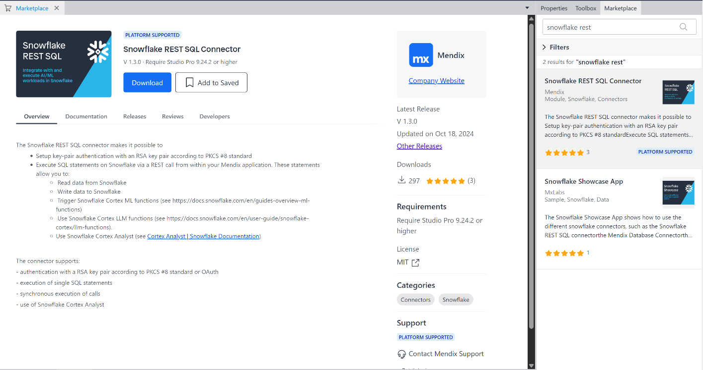

When the download is completed, some errors will occur because dependency modules of the Snowflake REST SQL Connector also need to be downloaded into the application. All these downloads will be done inside Mendix Studio Pro and do not require any external installation.

4. Download the latest [GenAI Commons](https://marketplace.mendix.com/link/component/227933), [Encryption](https://marketplace.mendix.com/link/component/1011) and [Community Commons](https://marketplace.mendix.com/link/component/170) modules into your application from the Mendix Marketplace. To be able to use the functionalities of the Encryption module, the **EncryptionKey** and **EncryptionPrefix** constants must be set, for more detailed information please take a look [here](https://docs.mendix.com/appstore/modules/encryption/#configuration).

We have included a few .mpk files where previous steps have been implemented which you can use as a reference or when you get stuck along the way. The certificate you need to connect to Snowflake environment isn't included for obvious reasons and connection details will have to be configured in any of these .mpk files.

[Download .mpk](assets/REST_SQL_Quickstart.mpk "download")

If you are not using Mendix Studio Pro 9,24,2 you might get some errors that need to be solved before you can continue due to migration of the downloaded appstore modules. Navigate to the **Errors** panel and resolve the errors (most likely by right clicking on them and updating widgets).

In order to use the capabilities of Snowflake in a Mendix app with the Snowflake REST SQL connector, an authentication method must be set up. For example purposes, we will set up a key-pair authentication method.

5. Configure [key-pair authentication in Snowflake](https://docs.snowflake.com/en/user-guide/key-pair-auth)
     - Generate a private key
     - Generate a public key
     - Assign the public key to a Snowflake user
  
To make it easier for users to configure the key-pair authentication in a Mendix application, the Snowflake REST SQL connector includes pages and microflows that you can simply drag and drop into your own modules.

6. Set up key-pair authentication in Mendix. If you need any help with with how to create pages or on how to configure security you can have have a look at the [rapid developer learning paths](https://academy.mendix.com/link/paths) provided by Mendix for free!
     - Right click on the **MyFirstModule** module and click the add page button to add a new blank page. Call it **Configuration_Page** and navigate to **Navigation** in the app explorer and add the page to your navigation.
     - Solve the resulting error by navigating to the **configuration_Page** you have created and in the page properties under the Navigation section select Vissible for **User** and click OK.
     - In the **App Explorer**, under the **SnowflakeRESTSQL** section, find the **SNIPPET_SnowflakeConfiguration** snippet and drag and drop it into the page you have just created.
     - If security has been enabled in the application, to be able to use the functionality in this snippet, give your user role access by assigning the module role **SnowflakeRESTSQL.Administrator** to the application roles that will be used to set up the configuration.
     - Run the application and then *View App*.

       Place holder text for .mpk 2 with page implemented.
       
     - 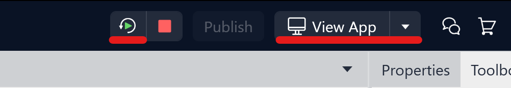
     - Go to the page where you added the snippet
     - Click **New**
     - On the **Connection details** page, fill out all fields with the details of your Snowflake account
       - `Name`: An identifier of the connection inside the Mendix app. This property is not passed to Snowflake.
       - `AccountURL`: The unique account URL of the Snowflake account within your organization to connect to the [Snowflake API](https://sdc-prd.snowflakecomputing.com)
       - `ResourcePath`: The path to a resource in Snowflake API, for example, `/api/v2/statements`
       - `AccountIdentifier`: The unique account identifier that identifies a Snowflake account within your organization 
       - `Username`: The username with which you sign in to your Snowflake account.
     - Enter the passphrase and upload your private key file in *.p8* format
     - Click **Save** to save the connection, or click **Save and test connection** to generate a JSON Web Token (JWT) and validate your connection.

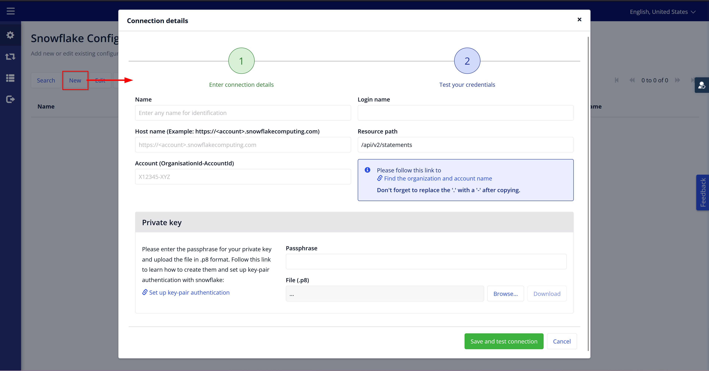

<!-- ------------------------ -->
## Getting to Know the Snowflake REST SQL Connector
Duration: 10

After you configure the authentication for Snowflake, you can implement the functions of the connector by using the provided activities in microflows. 

The main activity that allows users the ability to execute SQL statements in Snowflake from within their Mendix applications is the **POST_v1_ExecuteStatement** microflow action under the **SnowflakeRESTSQL** module.

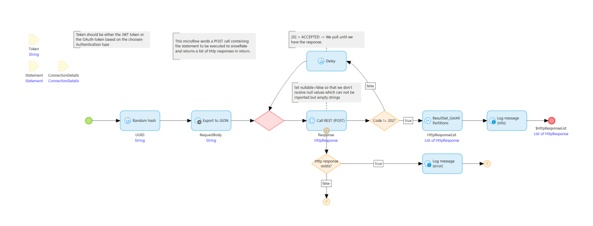

If you take a look at the given image above, you will see that three input parameters are needed to successfully complete this action and retrieve the list of HttpResponse objects:
- ConnectionDetails: The object that has been created in the previous step to configure authentication
- Token: Either the JWT token or the OAuth token based on the choosen Authentication type. As we are using key-pair authentication for example purposes, this token can be retrieved using the ConnectionDetails object by calling the **ConnectionDetails_GenerateToken_JWT** microflow.
- Statement: The object that holds all request-specific information which shall be used to conduct the request
  - `SQLStatement`: The SQL statement to execute
  - `Timeout`: The amount of seconds after which the connection will be closed
  - `Database`: The database to use
  - `Schema`: The database schema to use
  - `Warehouse`: The warehouse to use for computations
  - `Role`: The role with sufficient permissions to use to execute the SQL statement

The use of this microflow will send a POST call containing the statement to be executed to Snowflake and return a list of HttpResponse objects, that the user can then use as necessary.

An extended microflow, the **ExampleImplementation** microflow, has been implemented and added to the Snowflake REST SQL connector as an example for users that would like to retrieve a list of objects from an existing table in Snowflake. It contains the `TransformResponsesToMxObjects` activity that allows users to transform the list of `HttpResponse` objects into objects of the entity of their choice. It requires a list of `HttpResponse` objects and the entity of the objects that you would like to create with the received information. It returns a list of Mendix objects of the entity given in the input.

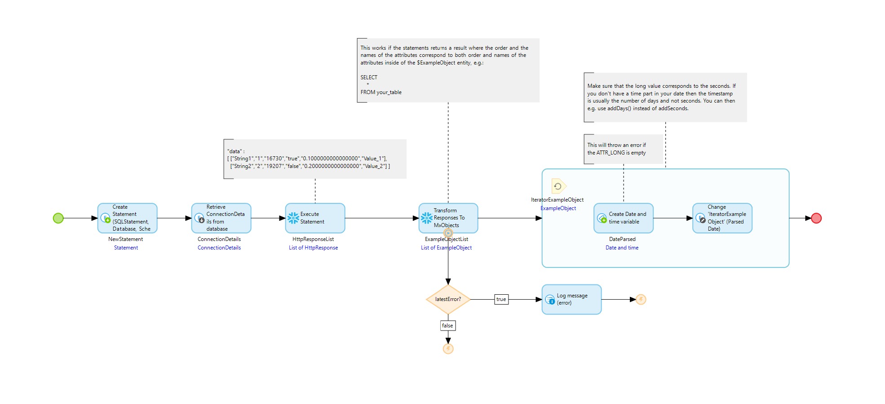

To showcase this, we have created an example entity in the domain model of the connector:

**ExampleObject**
- `ATTR_TXT` (string)
- `ATTR_INT` (integer)
- `ATTR_LONG` (long)
- `ATTR_BOOL` (Boolean)
- `ATTR_DECI` (decimal)
- `ATTR_ENUM` (enumeration)
- `ParsedDate` (date and time)

This entity is only an example. You must review properties such as the naming of the attributes, what datatypes they have or in which order they are added, and configure them according to your needs. This information is important after the entity has been decided on and the data will be received from a Snowflake account. The order in which you receive the columns from a Snowflake table, the name of these columns as well as the datatypes of these values must match the entity that you have selected.

For example, a table in Snowflake may contain multiple columns named `column1, column2,.......,column8`. To retrieve data from the column, create `ExampleObject` objects and display them on a page, you must execute an SQL statement that would retrieve the table columns with the same name of attributes and have the same datatypes. After making sure that the datatypes in Snowflake and Mendix match, you can execute a statement such as the one shown in the following example:

```sql
SELECT 
     column1 as ATTR_TXT,
     column2 as ATTR_INT,
     column3 as ATTR_LONG,
     column4 as ATTR_BOOL,
     column5 as ATTR_DECI,
     column6 as ATTR_ENUM
FROM your_table 
```

If the attribute names, datatypes and their order match, the `TransformResponsesToMxObjects` activity automatically converts the retrieved data into Mendix objects.


<!-- ------------------------ -->
## Presenting Snowflake Data in Mendix
Duration: 15

An [entity](https://docs.mendix.com/refguide/entities/) in Mendix represents a class of real-world objects and an instance of an entity is called an object. [Microflows](https://docs.mendix.com/refguide/microflows/) allow you to express the logic of your application. It can perform actions and is a visual way of expressing what traditionally ends up in textual program code.

Using the information in the previous step, we will now configure the application to be able to retrieve the data from the "Employee Info" table we have set up in the Snowflake environment in Step 2.

1. Open your domain model and create an entity to specify your table called *Table*. Change the **Persistable** option to No.
2. Create another entity for the objects that will be created while importing employee information from you table in Snowflake. Make sure the names and types of the attributes match the names, types and order of the "Employee Info" table. Change the **Persistable** option to No.

```
Employee
- Employee_id (Integer)
- Name (String)
- Surname (String)
- Date_of_Birth (Long)
- Is_Active_Employee (Boolean)
- Date_of_Birth_Parsed (Date and time)
```

3. Pull from a corner of the Employee entity to the Table entity to create a [1-* association](https://docs.mendix.com/refguide/associations/#one-to-many) between Table and Employee.

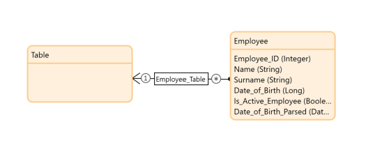

4. After the entities are created, we need to configure the microflow that will enable us to retrieve the information from the table and display it.
- Duplicate the **EXAMPLE_ExecuteStatement** microflow into your module and rename it to *Employee_Retrieve*.
- Create a new microflow by right clicking the *MyFirstModule* module and choosing the **Add microflow** option. Call it *ACT_Employee_RetrieveAndShow* and drag in the *Employee_Retrieve* microflow from the **App Explore**.
- The first component in the *Employee_Retrieve* microflow is the *Create Statement* action. Let's edit this to be relevant to our needs.
```
- SQLStatement: 'SELECT * FROM EMPLOYEE_INFO'
- Database: 'DATABASE_QUICKSTART'
- Schema: 'SCHEMA_QUICKSTART'
- Warehouse: *Desired warehouse*
- Role: *Snowflake role with suffficient rights to execute statement eg. 'ACCOUNTADMIN'*
```
- The second component is the *Retrieve ConnectionDetails* action. We will also need to configure this to retrieve the authentication method we created on Step 2
  - XPath Constraint: [Name='*name_of_your_connection*']
- The third and fourth components are to retrieve the authentication token and execute the statement in Snowflake and can stay as they are.
 - Before the *Transform Responses To MxObjects* action, from the **Toolbox** tab of the right side window, find and add a **Create Object** action. Select the entity *Table* and name the object *NewTable*. We will associate all *Employee* objects we find with this *Table* object to display them.
 -  Next is the *Transform Responses To MxObjects* action. This will also need to be configured
    - Entity: Employee
 - Then we will configure the components in the loop to use the "Date_Of_Birth" values from Snowflake and convert them to the Mendix Date and time format and save it to "Date_Of_Birth_Parsed"
   - Change the value of the *Create Variable* component: addSeconds(dateTimeUTC(1970,1,1),$IteratorExampleObject/Date_of_Birth)
   - In the *Change Object* component:
     -  Double-click the "ParsedDate" value and change the Member value to "Date_of_Birth_Parsed".
     -  Click **New** to add a new Member and choose the association *MyFirstModule.Employee_Table*. Set the value as *$NewTable*.
- Set the *$NewTable* variable as return value of the microflow by right clicking the **Create Table** action and choosing the **Set $NewTable as return value** option.
  
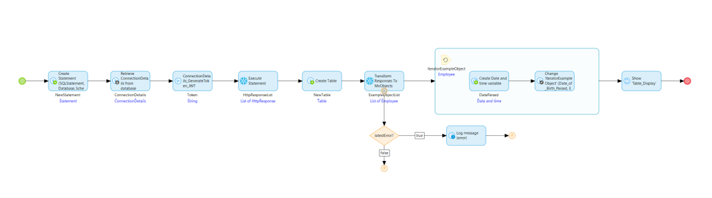

5. As the microflow is almost complete, let's prepare the display.
- Create a new Blank page and call it **Table_Display**.
- Open it and drag a **Data view** from the **Toolbox** onto the page and select the *Table* entity as the data source from Context.
- In the **Toolbox** tab of the right side window, find **Data grid** and drag it into *Table* data view.

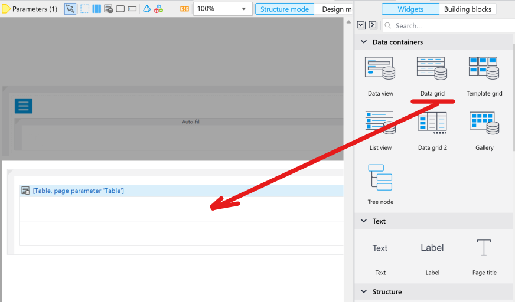

 - Double-click the newly added data grid and go to the **Data source** tab. Change the type to **Association** and select the entity *Employee*. You can find the entity by double-clicking on Table and opening the association or using the search. Click **OK**.
  
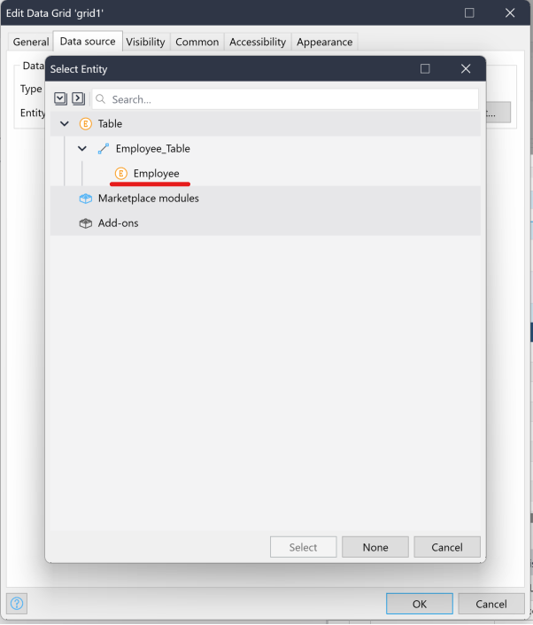

 - A question will pop up: Do you want to automatically fill the contents of the data grid? Click **Yes**.

6. We have now configured the microflow to retrieve information from the table and the page that will be used to diplay this information. Now, we need to add an action button that will trigger the retrieve call to Snowflake and will open the **Table_Display** page. Open the page **Home_Web** and add a **Call microflow button**  widget from the **Toolbox**. Choose *ACT_Employee_RetrieveAndShow* as the microflow to trigger and rename it to *Retrieve and Show Employee Info*.
7. Double click the *Employee_Retrieve* microflow call action and in the *output* section set the object name to *Table* and press *OK*. At the end of the *ACT_Employee_RetrieveAndShow* microflow add a **Show page** operation and select the *Table Display* page and press OK.

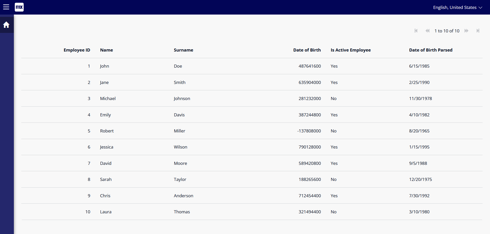

8. In the microflow properties give access to the *User* role to solve the error that has popped up. Now additional errors related to the data view and datagrid on the **Table_Display** page will appear. Solve these by Navigating to the domain model and giving read rights to all attributes of the *Employee* entity by double clicking the entity and navigating to the **Access rules** tab. Here you can create new access rules by pressing the new button and you will need to give all attributes read rights. Since the Table entity doesn't have attributes please give the entity Create rights to solve the errors related to the *Table* entity.
9. Run the application and click on this button to retrieve and display the employee information from Snowflake.


Placeholder text for .mpk 3. Please remember to configure connection details when using this .mpk.

<!-- ------------------------ -->
## Updating Snowflake Data from Within Mendix
Duration: 15

Now, we will extend our module to be able to edit the existing data in Snowflake.

1. Go to the display page. Above the attribute columns in the a white area, right-click and choose *Add button->Action*
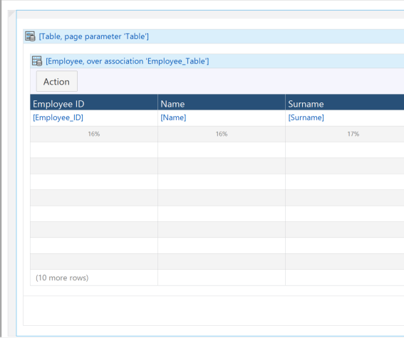
2. Double-click on this new button and change the caption to "Edit". Change the **On-click** event to *Show a page*. Click on **New**, change the name of the new page to be "Employee_Edit", go to section **Forms** and select **Form Vertical**.
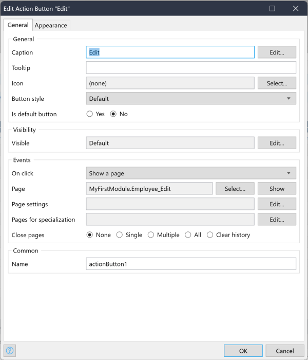
3. Open the new page and delete the text box for "Employee_ID". This is a unique ID that will be given to employees and should never be edited.
4. Next, delete the text box for "Date_Of_Birth". This is a long value that is retrived from Snowflake which is then converted to Date and time. We will use the "Date_Of_Birth_Parsed" and convert it to the correct format in the microflow that will be triggered.
5. Navigate to the *Properties* of the page and in the *Navigation* section for *Visible for* select *User* to give the user access to the page and solve the security error.
6. We need to now configure the microflow that will enable us to update the information in the Snowflake table.
  - Duplicate the **EXAMPLE_ExecuteStatement** microflow into your module and rename it to something like *Employee_Update*
  - Add a **Parameter** above the microflow from the **Toolbox**. **Name** is *Employee* and as the **Data type** keep *Object*. Click on **Select** and choose *Employee* as the entity.
  - The first component in the microflow is the *Create Statement* action. Let's edit this to be relevant to our needs.
```
  - SQLStatement: 
  'UPDATE EMPLOYEE_INFO SET 
    NAME = ''' + $Employee/Name+ ''', 
    SURNAME = ''' + $Employee/Surname+ ''', 
    DATE_OF_BIRTH = to_timestamp_ntz(''' + formatDateTime($Employee/Date_of_Birth_Parsed, 'yyyy-MM-dd') + '''), 
    IS_ACTIVE_EMPLOYEE = ''' + toString($Employee/Is_Active_Employee) + '''  
   WHERE EMPLOYEE_ID = ' + $Employee/Employee_ID + ';'
  - Database: 'DATABASE_QUICKSTART'
  - Schema: 'SCHEMA_QUICKSTART'
  - Warehouse: *Desired warehouse*
  - Role: *Snowflake role with suffficient rights to execute statement*
```
- The second component is the *Retrieve ConnectionDetails* action. We will also need to configure this to retrieve the authentication method we created on Step 2
   - XPath Constraint: [Name='*name_of_your_connection*']
 - The third and fourth components are to retrieve the authentication token and execute the statement in Snowflake and can stay as they are.
 - The rest of the components can be deleted. 
 - Let's add the microflow we created in Step 4 to the end of this microflow. Then we can retrieve the employee information again and check the changes.
  
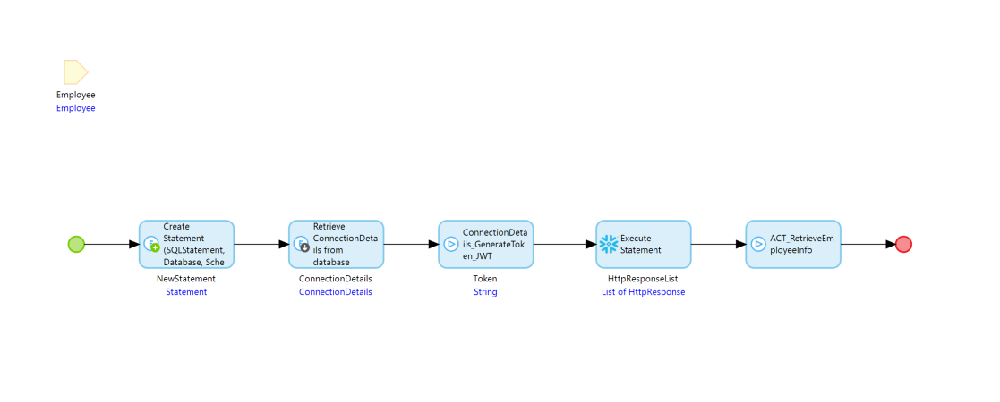

6. Open the "Employee_Edit" page and double-click on the **Save** button. Change the **On-click** event to *Call a microflow* and create a new microflow called *ACT_Employee_Update* so that this microflow will be triggered whenever the information is changed and the **Save** button is clicked.
7. Drag *Emplyee_Update* into *ACT_Employee_Update* from the app explorer and after that drag the *Employee_Retrieve* microflow in there as well. Call the return value of the *Employee_Retrieve* microflow call to *Table*. Add a **Show page** action at the end of the *ACT_Employee_Update* microflow and make it call the *Table_Display* page.
   
   
   
8. Run the application and test the functionalities of these buttons to update information in your Snowflake environment.

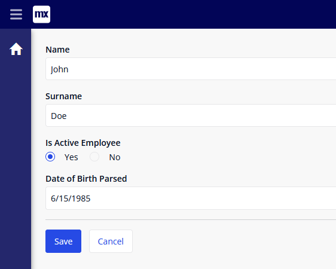

Placeholder text for .MPK nr 4

<!-- ------------------------ -->
## (Optional) Deploy the Mendix Application
Duration: 10

[Mendix Cloud](https://docs.mendix.com/developerportal/deploy/mendix-cloud-deploy/) is the default [deployment](https://docs.mendix.com/developerportal/deploy/mendix-cloud-deploy/deploying-an-app/) option for Mendix applications. It is a public cloud service for Mendix applications, with infrastructure built and maintained by Mendix and built on top of Amazon Web Services (AWS). The application you created can be be deployed on a free cloud sandbox environment to gain access to it from different browsers on the web and mobile. However, as the application and data on the application will be shared to the public, we always recommend security first be set up on the application before a deployment is done. You can implement security on the application yourself by using the [*Security*](https://docs.mendix.com/refguide/security/) Mendix documentation or you can install a security set up version here. (TODO: ADD FILE TO DOWNLOAD!!)

1. (Optional) Download the mpk file that includes the previous implemented steps as well as security. (TODO ADD FILE)
2. (Optional) Once downloaded, execute the file titled `SnowflakeRESTSQL-Quickstart.mpk`, a window prompt should appear
3. (Optional) Create a new folder and select it to unpack the project files. After unpacking, the project should appear in Mendix Studio Pro version 9.24
4. Inside Mendix Studio Pro, navigate to `Version Control`, then click `Upload to Version Control Server...` and confirm by clicking `OK`. A window titled Upload App to Team Server should appear
5. After the project has been uploaded to version control server, click `Publish`
6. After a while a snackbar notification is displayed `Your application is published`
7. Click `View App` to see the login screen for your Mendix application
  - (Optional) To log into your Mendix application
    - Use the username `demo_administrator`
    - To retrieve the password for this user inside Mendix Studio Pro, navigate to `App 'SFShowcase'` -> `Security` -> `Demo users` -> `demo_administrator` and then click the link that reads `Copy password to clipboard`
8. Save the endpoint of your Mendix application, you'll need it later
  - Save `https://snowflakerestsql-quickstart-sandbox.mxapps.io/` if your endpoint is `https://snowflakerestsql-quickstart-sandbox.mxapps.io/login.html?profile=Responsive` 
- You have successfully deployed the Snowflake Showcase App onto a free cloud sandbox environment!


9. Add your authentication method in the homepage after logging in.
10. Go back to Mendix Studio Pro and configure your Snowflake information in *Employee_Retrieve* and *Employee_Update*. 
  
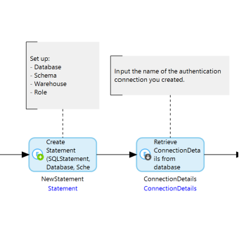

11. Click on publish again to deploy the application with the lates changes.

You can now use the microflows to retrieve and update Snowflake data from within Mendix.

<!-- ------------------------ -->
## Conclusion and Resources

Congratulations! You've successfully used the Snowflake REST SQL Connector and executed SQL statements in Snowflake from within a Mendix application.

If you’d like to learn more about Mendix please check out our [Rapid Developer Course](https://academy.mendix.com/link/paths/31/Become-a-Rapid-Developer) or explore other [learning paths](https://academy.mendix.com/link/home).

### What You Learned

- How to quickly configure the Snowflake REST SQL COnnector in a Mendix application.
- How to execute SQL statements in Snowflake from within a Mendix application.

### Related Resources

- [Snowflake REST SQL Connector documenation](https://docs.mendix.com/appstore/connectors/snowflake/snowflake-rest-sql/)
- [What is Mendix](https://www.mendix.com/)
- [Snowflake REST SQL Connector Listing](https://marketplace.mendix.com/link/component/225717)

